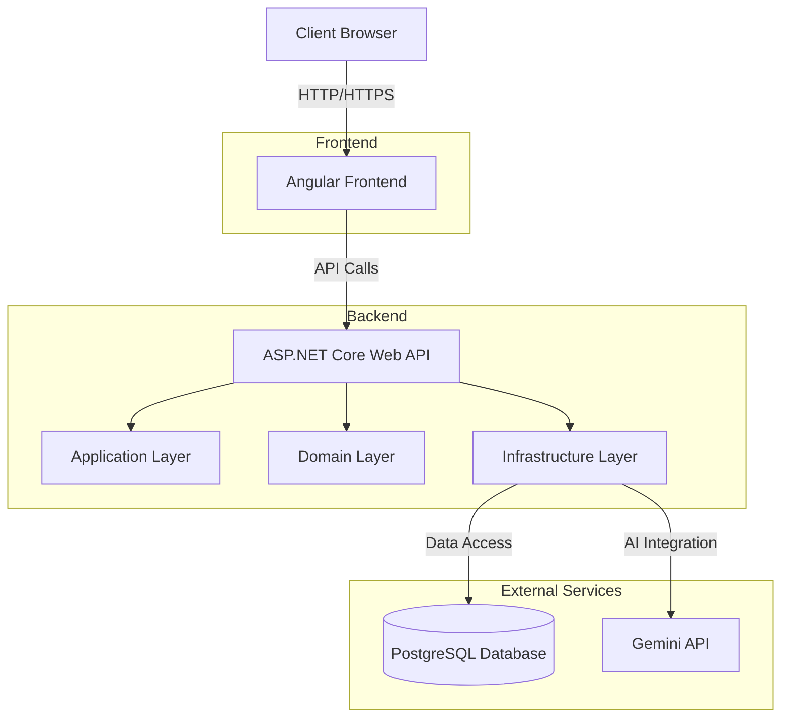

Overall architecture of the application


Add migration
```bash
dotnet ef migrations add <name> --verbose -s .\API\ -p .\Infrastructure\
````

Apply migration
```bash
dotnet ef database update --verbose -s .\API\ -p .\Infrastructure\
```