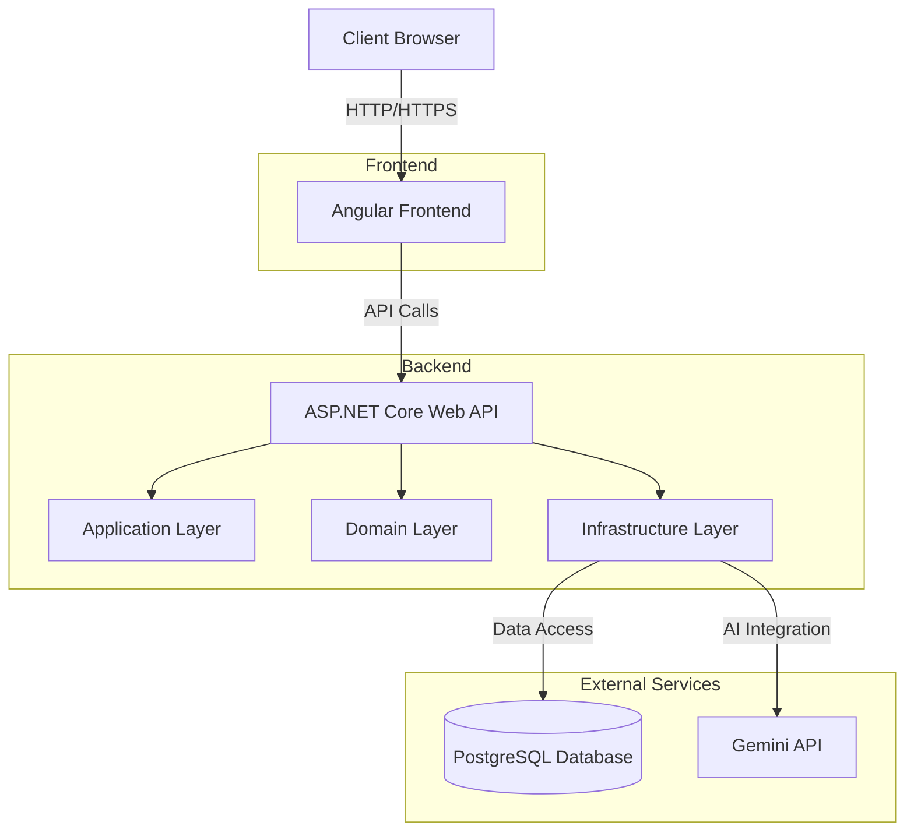

Overall architecture of the application


Add migration
```bash
dotnet ef migrations add <name> --verbose -s .\API\ -p .\Infrastructure\
````

Apply migration (manually)
```bash
dotnet ef database update --verbose -s .\API\ -p .\Infrastructure\
```

## Connect to websocket through postman payload
```json
{"protocol":"json","version":1}
```

## Call server method through postman websocket
```json
{
  "target": "SendP2PMessage",
  "type": 1,
  "arguments": [
    {
      "sentToUserId": "e539848a-d654-47c2-8704-c584541ec310",
      "conversationId": "481956e8-6e10-4d15-b81b-b22a67391385",
      "content": "hello world"
    }
  ]
}
```